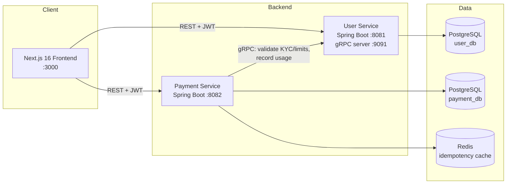

# XuPay — E-Wallet Microservices Platform

A production-style digital wallet (fintech) platform built with **Java Spring Boot microservices**, **gRPC**, **double-entry ledger accounting**, **Redis-backed idempotency**, rule-based **fraud detection**, and a modern **Next.js 16** frontend.

> Built as a portfolio project to demonstrate real-world backend engineering patterns used by payment companies: money is never a `balance` column — it is an immutable, balanced ledger.

---

## ✨ Features

| Domain | Capabilities |
|---|---|
| **Accounts & Auth** | Register/login with JWT (24h), BCrypt password hashing, account suspension, stateless sessions |
| **KYC & Limits** | 4 KYC tiers (TIER_0 → TIER_3), document upload/approval workflow, per-tier daily/monthly transaction limits, daily usage tracking |
| **Wallets** | Personal/Business/Merchant wallets mapped to GL accounts, freeze/unfreeze, balance derived 100% from the ledger |
| **Payments** | P2P transfer, deposit (top-up), withdrawal — all as balanced double-entry ledger transactions |
| **Idempotency** | Client-generated idempotency keys; Redis cache (24h TTL) with PostgreSQL fallback prevents duplicate charges on retry |
| **Fraud Detection** | Configurable rules (velocity, amount threshold): score, flag or block transactions before they execute |
| **Frontend** | Dashboard, wallets, transactions, KYC flows, fraud dashboards — Next.js 16, React 19, TanStack Query, Tailwind 4 |

---

## 🏗 Architecture



**Why two databases?** Each service owns its data (database-per-service). The Payment Service never reads `user_db` — it asks the User Service over gRPC ("can this user send 50,000₫ right now?"), keeping service boundaries honest.

### The money model (double-entry ledger)

Every financial operation writes **two balanced ledger entries** inside one ACID transaction:

| Operation | Debit (↑) | Credit (↑) |
|---|---|---|
| **Deposit** | User wallet (asset) | `2110 User Balances` (liability) |
| **P2P transfer** | Receiver wallet | Sender wallet |
| **Withdraw** | `2110 User Balances` (liability) | User wallet (asset) |

- A **deferred PostgreSQL constraint trigger** rejects any transaction where `Σdebits ≠ Σcredits`.
- Wallet balance is **never stored** — it is `SUM(debits) − SUM(credits)` over the wallet's ledger entries (`get_wallet_balance()`).
- Ledger entries are **immutable**: corrections are new reversal entries, never updates.

### The transfer pipeline

```
POST /api/payments/transfer
  1. Idempotency check (Redis → DB fallback) — replay returns cached response
  2. Fraud evaluation (velocity + amount rules) — may FLAG or BLOCK
  3. gRPC → User Service: validate sender (KYC tier, limits, account status)
  4. gRPC → User Service: validate receiver
  5. Wallet checks (active, not frozen) + balance check
  6. Write transaction + 2 balanced ledger entries (ACID)
  7. Async gRPC: record usage towards daily limits (non-blocking)
  8. Cache response under idempotency key (24h)
```

---

## 🧰 Tech Stack

| Layer | Technology |
|---|---|
| Backend | Java 21, Spring Boot 3.4, Spring Security (JWT), Spring Data JPA, Flyway |
| Inter-service | gRPC + Protocol Buffers (grpc-spring-boot-starter) |
| Data | PostgreSQL 15 (×2), Redis 7 |
| Frontend | Next.js 16, React 19, TypeScript 5, TanStack Query, Zustand, Tailwind CSS 4, Radix UI, Recharts |
| Testing | JUnit 5 + Mockito (70 backend tests), Vitest + Testing Library + MSW (457 frontend tests) |
| Infra | Docker Compose, GitHub Actions CI, multi-stage Dockerfiles |

---

## 🚀 Quick Start

### Option A — Docker (everything)

```bash
cp .env.example .env       # optional: change secrets
docker compose up -d --build
```

| URL | What |
|---|---|
| http://localhost:3000 | Frontend |
| http://localhost:8081/swagger-ui.html | User Service API docs |
| http://localhost:8082/actuator/health | Payment Service health |

### Option B — Local development

```bash
# 1. Infrastructure only
docker compose up -d postgres-user postgres-payment redis

# 2. Backend services (two terminals)
cd backend/user-service    && ./mvnw spring-boot:run
cd backend/payment-service && ./mvnw spring-boot:run

# 3. Frontend
cd frontend/xupay-frontend
npm ci && npm run dev      # http://localhost:3000
```

> Frontend without any backend: `NEXT_PUBLIC_USE_MOCKS=true npm run dev` (in-memory mock clients).

### Demo flow (2 minutes)

1. **Register** two accounts at `/register` (e.g. `alice@x.com`, `bob@x.com`)
2. Each user: **create a wallet** (Wallets page)
3. Alice: **Deposit** 500,000₫ (top-up)
4. Alice → Bob: **Transfer** 100,000₫
5. Check both balances and the **transaction detail** — you'll see the two balanced ledger entries (DEBIT/CREDIT)

---

## 🧪 Testing

```bash
# Backend (per service)
cd backend/user-service    && ./mvnw test     # 32 tests
cd backend/payment-service && ./mvnw test     # 38 tests

# Frontend
cd frontend/xupay-frontend
npm test                                       # 457 tests (Vitest)
npm run build                                  # production build
```

CI runs all of the above on every push (see `.github/workflows/ci.yml`).

---

## 📁 Project Structure

```
XuPay/
├── backend/
│   ├── user-service/          # Auth, profiles, KYC, limits (REST 8081, gRPC 9091)
│   │   └── src/main/java/com/xupay/user/
│   │       ├── controller/    # REST endpoints (Auth, User, KYC)
│   │       ├── service/       # Business logic
│   │       ├── grpc/          # gRPC server (validate/record for Payment Service)
│   │       ├── security/      # JWT filter chain
│   │       └── entity/        # JPA entities (User, KycDocument, limits, ...)
│   └── payment-service/       # Wallets, ledger, transfers, fraud (REST 8082)
│       └── src/main/java/com/xupay/payment/
│           ├── controller/    # Transaction + Wallet endpoints
│           ├── service/       # Transfer/deposit/withdraw + fraud + idempotency
│           ├── grpc/          # gRPC client → User Service
│           └── entity/        # Wallet, Transaction, LedgerEntry, FraudRule, ...
├── frontend/xupay-frontend/   # Next.js 16 app (App Router)
│   └── src/
│       ├── app/               # Pages: dashboard, wallets, transactions, kyc, fraud...
│       ├── components/        # UI components (+ colocated tests)
│       ├── hooks/api/         # TanStack Query hooks per domain
│       ├── lib/               # Typed API clients (real + mock) & adapters
│       └── providers/         # Auth, React Query, Theme providers
├── infrastructure/db/         # Full SQL schemas (triggers, functions, seeds)
├── docs/                      # Spec, API reference, Postman collections, diagrams
├── scripts/                   # Dev & API smoke-test scripts (PowerShell)
└── docker-compose.yml         # Full stack: 2 DBs, Redis, 2 services, frontend
```

---

## 📚 Documentation

| Doc | Purpose |
|---|---|
| [docs/spec.md](docs/spec.md) | Full product & technical specification |
| [docs/api/USER_SERVICE_API_DOCUMENTATION.md](docs/api/USER_SERVICE_API_DOCUMENTATION.md) | User Service API reference |
| [docs/api/PAYMENT_SERVICE_API_DOCUMENTATION.md](docs/api/PAYMENT_SERVICE_API_DOCUMENTATION.md) | Payment Service API reference |
| [docs/api/*.postman_collection.json](docs/api/) | Postman collections for manual testing |
| [docs/INTERVIEW_GUIDE.vi.md](docs/INTERVIEW_GUIDE.vi.md) | Deep-dive study guide (Tiếng Việt) |
| [docs/uml_class_diagram.md](docs/uml_class_diagram.md) | Entity/class diagrams |

---

## 🛣 Roadmap

- [ ] Audit Service (Go) — immutable event log, SAR/AML reporting (schema already designed in `infrastructure/db/audit-service/`)
- [ ] API Gateway (NGINX/Kong) — single entry point, rate limiting
- [ ] RabbitMQ event bus — async audit events, notifications
- [ ] E2E tests (Playwright) against the Docker stack

## ⚖️ Disclaimer

Educational/portfolio project — not a licensed payment institution. Default credentials in `docker-compose.yml` are for local development only.
