# VIETNAM NATIONAL UNIVERSITY – HOCHIMINH CITY
## INTERNATIONAL UNIVERSITY
### SCHOOL OF COMPUTER SCIENCE AND ENGINEERING

---

# WEB APPLICATION DEVELOPMENT
## IT093IU
## FINAL REPORT

**Topic:** XUPAY - MODERN PAYMENT SERVICE SYSTEM
**(Project Github: [Your GitHub Link])**

**By Group:** [Your Group Name]

### Members List

| Number | Name | Student ID | Role |
|--------|------|-----------|------|
| 1 | [Member Name] | [Student ID] | Leader |
| 2 | [Member Name] | [Student ID] | Member |
| 3 | [Member Name] | [Student ID] | Member |
| 4 | [Member Name] | [Student ID] | Member |

**Instructor:** [Instructor Name]

---

# TABLE OF CONTENTS

- I. INTRODUCTION
  - 1. ABOUT US
  - 2. THE PRODUCT'S INFORMATION
  - 3. WORK BREAKDOWN STRUCTURE
  - 4. DEVELOPMENT PROCESS
  - 5. DEVELOPMENT ENVIRONMENT

- II. REQUIREMENT ANALYSIS AND DESIGN
  - 1. REQUIREMENT ANALYSIS
  - 2. DESIGN

- III. IMPLEMENTATION
  - 1. USER SERVICE IMPLEMENTATION
  - 2. PAYMENT SERVICE IMPLEMENTATION
  - 3. FRONTEND INTEGRATION

- IV. DISCUSSION AND CONCLUSION

- V. REFERENCE

---

# I. INTRODUCTION

This section presents background information about the software development team. It also introduces the core concept and basic details of the "XUPay Payment Service System" project.

## 1. ABOUT US

[Your Team Name] is a team of four members formed as part of the Web Application Development course project. The primary objective is to design and implement a functional payment service system that demonstrates advanced web application architecture, microservices design, and secure financial transaction processing. This project serves as valuable preparation for upcoming internships, allowing team members to gain hands-on experience with real-world tools, workflows, and problem-solving strategies.

Throughout the development process, knowledge gained from lectures, textbooks, and online resources has been applied to build a platform that incorporates essential features of modern fintech applications. The application supports:
- Secure user authentication and KYC (Know Your Customer) verification
- Multi-wallet management
- Real-time transaction processing
- Fraud detection and risk assessment
- RESTful API architecture with microservices

Here is the information of team members and the tasks distribution:

| Name | Task | Contribution |
|------|------|--------------|
| [Member 1] | [Role] | 25% |
| [Member 2] | [Role] | 25% |
| [Member 3] | [Role] | 25% |
| [Member 4] | [Role] | 25% |

## 2. THE PRODUCT'S INFORMATION

XUPay is a modern payment service system inspired by contemporary fintech platforms like Stripe, Square, and PayPal. The system provides a secure, scalable infrastructure for managing user wallets, processing transfers, and implementing fraud detection mechanisms.

### Key Features:
- **User Service**: Registration, authentication (JWT), KYC verification, contact management, transaction limits based on KYC tiers
- **Payment Service**: Wallet management, secure fund transfers, transaction history, idempotency for safe retries, real-time fraud detection
- **Security**: JWT authentication, encrypted passwords, role-based access control (RBAC)
- **Scalability**: Microservices architecture, Docker containerization, Redis caching, asynchronous processing

**Why this project?** Modern payment systems require complex coordination between multiple services, sophisticated fraud detection, and rigorous security measures. By building XUPay, we gain deep understanding of:
- Microservices architecture and service-to-service communication
- Secure financial transaction handling and idempotency patterns
- User identity verification and KYC compliance
- Real-time fraud detection and risk assessment
- API design best practices and REST conventions

## 3. WORK BREAKDOWN STRUCTURE

### System Architecture Overview

```
┌─────────────────────────────────────────────────────────────┐
│                     Frontend (React/TypeScript)             │
├─────────────────────────────────────────────────────────────┤
│                                                             │
│  ┌──────────────────┐        ┌──────────────────┐           │
│  │  User Service    │        │ Payment Service  │           │
│  │  - Auth          │        │ - Transfers      │           │
│  │  - Profile       │        │ - Wallets        │           │
│  │  - KYC           │        │ - Transactions   │           │
│  │  - Contacts      │        │ - Fraud Detection│           │
│  └──────────────────┘        └──────────────────┘           │
│         │                            │                      │
│         └────────────────┬───────────┘                      │
│                          │                                  │
├─────────────────────────────────────────────────────────────┤
│              Backend Services (Spring Boot)                 │
├─────────────────────────────────────────────────────────────┤
│                                                             │
│  ┌──────────────┐     ┌──────────────┐    ┌──────────────┐  │
│  │   Database   │     │    Redis     │    │   External   │  │
│  │  (PostgreSQL)│     │   (Cache)    │    │  Services    │  │
│  └──────────────┘     └──────────────┘    └──────────────┘  │
│                                                             │
└─────────────────────────────────────────────────────────────┘
```

**📍 INSERT HERE: System Architecture Diagram**

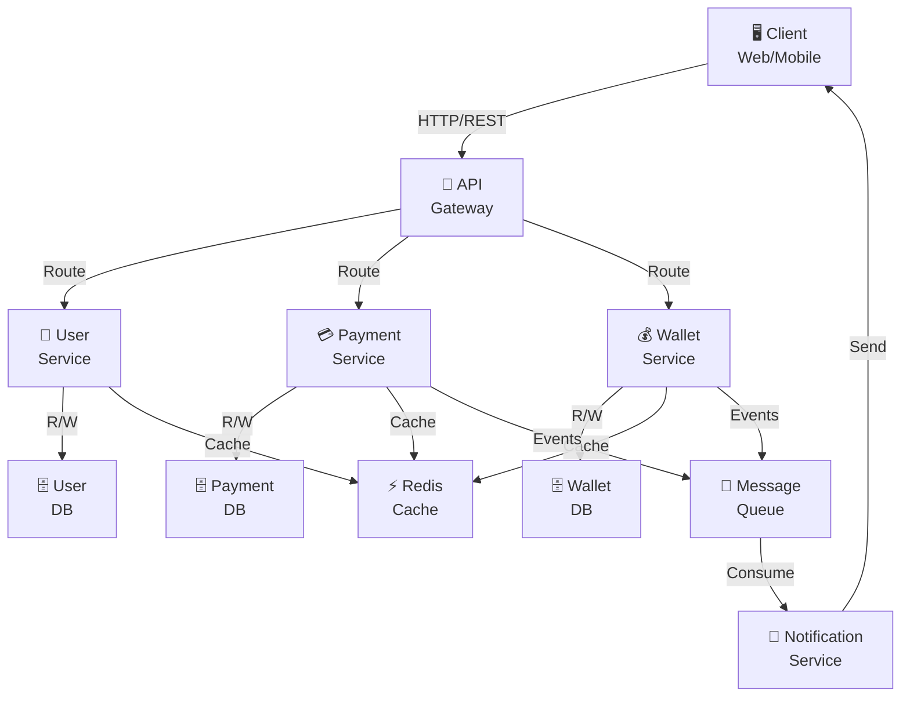

### Database Layer

#### Tasks:
- **Specification**: Define entities for User, Wallet, Transaction, KycDocument, Contact
- **Implementation**: Create PostgreSQL schema with proper relationships, indexes, constraints
- **Testing**: Validate relationships, primary keys, foreign keys, and complex queries

**Entities:**
- User (authentication, profile, KYC status)
- Wallet (personal/business wallets per user)
- Transaction (transfer history, status tracking)
- KycDocument (identity verification documents)
- Contact (saved payees/recipients)
- SAR (Suspicious Activity Reports)

### Backend Layer (Microservices)

#### User Service Tasks:
- **Specification**: Define packages, features (auth, profile, limits, KYC)
- **Implementation**: Entity models, repositories, DTOs, services, controllers, security config
- **Testing**: Validate all APIs, exception handling, JWT token lifecycle

#### Payment Service Tasks:
- **Specification**: Define wallet and transaction management features
- **Implementation**: Transaction service, wallet service, fraud detection integration
- **Testing**: Test idempotency, transfer flows, wallet freezing, error scenarios

### Frontend Layer

#### Tasks:
- **Specification**: Identify pages (login, dashboard, transfer, history), components, services
- **Implementation**: React components, context for state management, API service clients
- **Testing**: Test service integrations, API mappings, browser compatibility

**Key Pages:**
- Authentication (Login, Register)
- User Dashboard
- Transaction History
- Transfer/Payment Interface
- Profile & KYC Management

## 4. DEVELOPMENT PROCESS

This project follows the **Agile/Scrum methodology** with iterative development sprints:

```
Planning → Requirements → Design → Development → Testing → Review
   ↑                                                          │
   └──────────────────────────────────────────────────────────┘
```

**Phases:**
1. **Planning**: Define features and user stories
2. **Requirements Analysis**: Detail functional and non-functional requirements
3. **Design**: Create architecture, ERD, class diagrams
4. **Development**: Implement features incrementally
5. **Testing**: Unit, integration, and system testing
6. **Review**: Code review and refinement

**📍 INSERT HERE: Agile Process Diagram or Sprint Timeline**

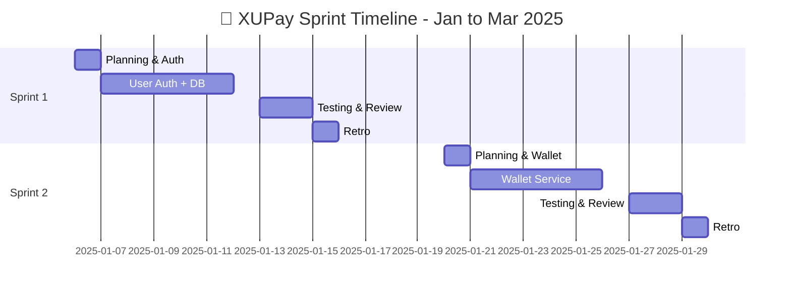

## 5. DEVELOPMENT ENVIRONMENT

### Programming Languages
- **Java**: Backend development (Spring Boot)
- **TypeScript/JavaScript**: Frontend development (React)
- **SQL**: Database queries (PostgreSQL)

### Frameworks & Libraries

#### Backend
- **Spring Boot 3.x**: REST API development, microservices architecture
  - **Spring Security**: JWT authentication, authorization
  - **Spring Data JPA**: ORM and database abstraction
  - **Spring Validation**: Input validation with annotations
  - **SpringDoc OpenAPI**: API documentation (Swagger)

#### Frontend
- **React 18.x**: Component-based UI framework
- **TypeScript**: Type-safe JavaScript development
- **Axios**: HTTP client for API communication
- **React Query**: Data fetching and state management
- **TailwindCSS**: Utility-first CSS styling

### Tools & Infrastructure

| Category | Tool | Purpose |
|----------|------|---------|
| Database | PostgreSQL | Persistent data storage |
| Cache | Redis | Session caching, rate limiting |
| Containerization | Docker | Service isolation and deployment |
| Container Orchestration | Docker Compose | Multi-service orchestration |
| API Testing | Postman | Request/response testing |
| Version Control | Git | Source code management |
| IDE | IntelliJ IDEA / VS Code | Code editor and debugging |
| Build Tool | Maven | Java project build automation |
| Package Manager | npm/yarn | JavaScript dependency management |

### Setup Instructions

#### Prerequisites
- Java 17+
- Node.js 16+
- Docker & Docker Compose
- PostgreSQL 14+
- Redis 6.0+

#### Running the Project

**Start Backend Services:**
```bash
cd backend
docker-compose up -d
mvn spring-boot:run  # User Service
# In another terminal: Payment Service
```

**Start Frontend:**
```bash
cd frontend
npm install
npm start
```

**📍 INSERT HERE: Screenshots of:**
- Docker Compose running
- Application running in browser
- User interface screenshots

**Local Dev / Proxy Setup (dev server & mock services)**

```mermaid
graph LR
    Browser["Browser (3000)"]
    DevServer["Dev Server / Static Server (3000)"]
    Proxy["Proxy Router"]
    UserMock["User Service (8081)"]
    PaymentMock["Payment Service (8082)"]
    StaticSite["static-site/"]
    
    Browser --> DevServer
    DevServer --> StaticSite
    DevServer --> Proxy
    Proxy -->|/api/auth/*| UserMock
    Proxy -->|/api/* (others)| PaymentMock
```


---

# II. REQUIREMENT ANALYSIS AND DESIGN

## 1. REQUIREMENT ANALYSIS

### Functional Requirements

#### FR-1: User Authentication & Registration
- **Actor**: New User
- **Precondition**: User does not have an account
- **Basic Flow**:
  1. User navigates to registration page
  2. Enters email, password, first name, last name, phone number
  3. System validates inputs (email format, password strength)
  4. System creates user account with TIER_0 KYC status
  5. User receives confirmation email
  6. User redirected to login page
- **Postcondition**: New user account created in database, KYC status = PENDING

#### FR-2: User Login
- **Actor**: Registered User
- **Precondition**: User has valid account
- **Basic Flow**:
  1. User enters email and password
  2. System validates credentials against database
  3. System generates JWT token (valid for 1 hour)
  4. Token set as an HttpOnly, SameSite=Strict cookie (page scripts cannot read it)
  5. User redirected to dashboard
- **Postcondition**: User authenticated, token stored, can access protected resources

#### FR-3: KYC Document Verification
- **Actor**: User (uploading), Admin (approving)
- **Precondition**: User authenticated
- **Basic Flow**:
  1. User uploads identity document (passport, driver's license, national ID)
  2. System stores document URL and metadata
  3. Admin reviews document
  4. If approved: User KYC tier upgraded (TIER_0 → TIER_1 → TIER_2 → TIER_3)
  5. Transaction limits updated based on tier
- **Postcondition**: KYC status updated, transaction limits adjusted

#### FR-4: Wallet Management
- **Actor**: User
- **Precondition**: User authenticated
- **Basic Flow**:
  1. System creates default personal wallet on registration
  2. User can view wallet balance
  3. User can create additional wallets (business, merchant)
  4. System tracks balance in cents (no floating point errors)
  5. Admin can freeze wallet if fraud detected
- **Postcondition**: Wallets created/managed, balance tracked accurately

#### FR-5: Fund Transfer (P2P Payment)
- **Actor**: Sender, Receiver
- **Precondition**: Both users authenticated, sender has sufficient balance
- **Basic Flow**:
  1. Sender initiates transfer with idempotency key
  2. System validates transaction limits (daily, hourly, single transaction max)
  3. System runs fraud detection check
  4. If approved: Debit sender, credit receiver
  5. Transaction recorded with status (COMPLETED, PROCESSING, FAILED)
  6. Both users notified
- **Postcondition**: Funds transferred, transaction logged, history updated

#### FR-6: Transaction Limit Checking
- **Actor**: User
- **Precondition**: User authenticated
- **Basic Flow**:
  1. User initiates transfer
  2. System checks:
     - Daily send limit (varies by KYC tier)
     - Daily receive limit
     - Single transaction max
     - Monthly volume limit
     - Transactions per hour
  3. System returns remaining allowance
- **Postcondition**: Limits enforced, transfer allowed/blocked

#### FR-7: Fraud Detection
- **Actor**: Payment Service
- **Precondition**: Transfer initiated
- **Basic Flow**:
  1. System extracts risk signals (amount, frequency, IP address, user agent)
  2. Fraud detection service assigns risk score
  3. If score < threshold: ALLOW
  4. If score mid-range: REVIEW (manual approval required)
  5. If score high: BLOCK
  6. Suspicious Activity Report (SAR) created for review
- **Postcondition**: Transaction allowed/blocked, SAR created if needed

#### FR-8: Idempotent Transfers
- **Actor**: Frontend/Client
- **Precondition**: Transfer with idempotency key submitted
- **Basic Flow**:
  1. Client includes `idempotencyKey` UUID
  2. First request: Processed normally
  3. Duplicate request (same key): Returns cached result
  4. No duplicate transaction created
- **Postcondition**: Safe retry mechanism, no duplicate charges

### Non-Functional Requirements

| Requirement | Specification |
|-------------|---------------|
| **Performance** | API response time < 500ms for 95% requests |
| **Availability** | 99.5% uptime SLA |
| **Security** | TLS/SSL encryption, JWT tokens, rate limiting, SQL injection prevention |
| **Scalability** | Support 10,000+ concurrent users, horizontal scaling via Docker |
| **Data Integrity** | ACID compliance, transaction consistency |
| **Compliance** | KYC/AML basic requirements, PCI-DSS principles for payment data |
| **Maintainability** | Clean code, comprehensive test coverage (80%+) |
| **Usability** | Mobile-responsive UI, intuitive navigation |

**📍 INSERT HERE: Use Case Diagram**

```mermaid
%% Use Case diagram (preferred) - works in newer Mermaid versions
usecaseDiagram
  :User: --> (Register)
  :User: --> (Login)
  :User: --> (View Dashboard)
  :User: --> (Create Wallet)
  :User: --> (Transfer Funds)
  :User: --> (Upload KYC)
  :Admin: --> (Review KYC)
  :System: --> (Send Notifications)
```

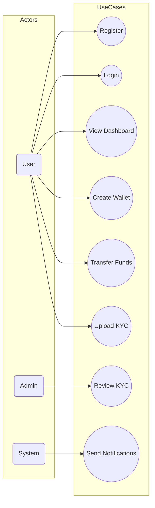
**📍 INSERT HERE: Functional Requirements Matrix**

| ID | Requirement | Description | Priority | Owner | Endpoint(s) | Acceptance Criteria | Test Cases | Status | Notes |
|----|-------------|-------------|----------|-------|-------------|---------------------|------------|--------|-------|
| FR-1 | User Registration | Sign up new users, create default wallet, validate email/phone | High | User Service | POST /api/auth/register | 201 Created + accessToken; user record created; default wallet exists | Unit + E2E: register flow; DB assert | ✅ Implemented | Password hashed (BCrypt) |
| FR-2 | User Login | Authenticate user and issue JWT | High | User Service | POST /api/auth/login | 200 OK + accessToken; token stored client-side | Unit + E2E: login, token used for protected endpoints | ✅ Implemented | Token TTL ~1h |
| FR-3 | KYC Upload & Verification | Upload identity docs, admin review, tier upgrade | Medium | User Service / Admin | POST /api/kyc/upload-document; GET /api/kyc/pending; POST /api/kyc/{id}/approve | Upload returns 202 Accepted (PENDING); admin can approve → KYC tier change | Integration: upload → admin approve → limits updated | ✅ Implemented (manual review) | S3 URL storage; validations in place |
| FR-4 | Wallet Management | Create/Close/Freeze wallets; balance retrieval | High | Payment Service | POST /api/wallets; GET /api/wallets/user/{userId}; PUT /api/wallets/{id}/freeze | Create wallet returns 201; balance endpoints return cents; freeze prevents TX | Unit + Integration: create, freeze, balance checks | ✅ Implemented | Wallet entity + controller present |
| FR-5 | Fund Transfer (P2P) | Secure transfers, idempotency, notifications | High | Payment Service | POST /api/payments/transfer | 201 Created / PROCESSING; idempotency respected; ledger entries created; notifications emitted | Integration + E2E: duplicate submit with same idempotencyKey doesn't double-charge | ✅ Implemented | Fraud checks integrated |
| FR-6 | Transaction Limits | Enforce per-KYC and per-user limits | Medium | User Service / Payment Service | GET /api/users/me/limits; POST /api/users/me/check-limit | Limits returned and enforced; blocked on exceed | Unit + Integration: limit exceeded case returns failure | ⚠️ Partial | Limits endpoints exist; full rule coverage TBD |
| FR-7 | Fraud Detection | Score transactions; REVIEW/BLOCK/ALLOW flow | High | Payment Service | Internal service (FraudDetectionService) + rules repo | Transactions flagged or blocked based on score; SAR created for REVIEW/BLOCK | Integration: simulated risk signal → expected action | ✅ Implemented | Rules stored in DB; thresholds configurable |
| FR-8 | Idempotency | Prevent duplicate transactions on retry | High | Payment Service | POST /api/payments/transfer (X-Idempotency-Key) | Duplicate submissions return same result; no duplicates in DB | Integration: retry with same key → no new txn | ✅ Implemented | Redis/IdempotencyCache used |

**Non-Functional Requirements (summary)**

| NFR-ID | Area | Requirement | Target | Status |
|--------|------|-------------|--------|--------|
| NFR-1 | Performance | API < 500ms (95th) | Backend perf targets | ⚠️ Ongoing - requires load testing |
| NFR-2 | Security | TLS, JWT, RBAC, password hashing | Required | ✅ Implemented (JWT, BCrypt); TLS depends on deployment |
| NFR-3 | Scalability | Docker + horizontal scaling | Required | ✅ Implemented (containerized with Docker Compose) |
| NFR-4 | Data Integrity | ACID transactions for transfers | Required | ✅ Implemented (DB tx + ledger entries) |

**Notes & Action Items:**
- "Partial" items (FR-6, NFR-1) need focused testing and rule coverage; recommend adding integration and load tests.
- If you want, I can export this matrix as CSV and add it to `report/` so it's easy to attach to your submission.

## 2. DESIGN

### System Architecture

```
┌─────────────────────────────────────────────────────────┐
│                    REST API Gateway                     │
├─────────────────────────────────────────────────────────┤
│                                                         │
│  ┌──────────────────────────┐   ┌────────────────────┐  │
│  │   User Service (8081)    │   │ Payment Service    │  │
│  │                          │   │ (8082)             │  │
│  │  - Auth Controller       │   │ - Transfer Ctrl    │  │
│  │  - User Controller       │   │ - Wallet Ctrl      │  │
│  │  - KYC Controller        │   │                    │  │
│  │                          │   │                    │  │
│  │  Services Layer:         │   │ Services Layer:    │  │
│  │  - AuthService           │   │ - TxnService       │  │
│  │  - UserService           │   │ - WalletService    │  │
│  │  - KycService            │   │ - FraudDetection   │  │
│  │  - LimitService          │   │ - IdempotencyMgr   │  │
│  │                          │   │                    │  │
│  │  Data Layer (JPA):       │   │ Data Layer (JPA):  │  │
│  │  - UserRepository        │   │ - TxnRepository    │  │
│  │  - KycDocRepository      │   │ - WalletRepository │  │
│  │  - ContactRepository     │   │                    │  │
│  └──────────────────────────┘   └────────────────────┘  │
│           │                             │              │
└───────────┼─────────────────────────────┼──────────────┘
            │                             │
       ┌────▼─────────────────────────────▼────┐
       │  PostgreSQL Database (Shared)         │
       │  - user_accounts                      │
       │  - kyc_documents                      │
       │  - wallets                            │
       │  - transactions                       │
       │  - suspicious_activity_reports        │
       └───────────────────────────────────────┘
            │
       ┌────▼──────────────────────────────┐
       │  Redis Cache                      │
       │  - Session tokens                 │
       │  - Rate limit buckets             │
       │  - Fraud risk scores              │
       └───────────────────────────────────┘
```

### Entity Relationship Diagram (ERD)

**📍 INSERT HERE: Database Schema ERD**

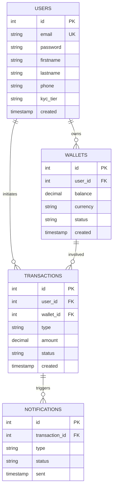

Your ERD should show:
- User table (id, email, password_hash, first_name, last_name, kyc_status, kyc_tier, fraud_score)
- Wallet table (id, user_id, wallet_type, currency, balance_cents, is_active, is_frozen)
- Transaction table (id, from_user_id, to_user_id, from_wallet_id, to_wallet_id, amount_cents, status, fraud_score, is_flagged)
- KycDocument table (id, user_id, document_type, verification_status, file_url)
- Contact table (id, user_id, contact_user_id, nickname)
- SuspiciousActivityReport table (id, transaction_id, user_id, severity, status, reason)

Relationships:
- User 1→N Wallet
- User 1→N Transaction (as sender & receiver)
- User 1→N KycDocument
- User 1→N Contact
- Transaction 1→1 SuspiciousActivityReport
- Wallet 1→N Transaction (from/to wallet)

### API Contract Design

#### User Service API

```
POST /api/auth/register
  Request: { email, password, firstName, lastName, phone }
  Response: { accessToken, expiresAt, user: { id, email, kycStatus, kycTier } }

POST /api/auth/login
  Request: { email, password }
  Response: { accessToken, expiresAt, user }

GET /api/users/me/profile
  Headers: { Authorization: "Bearer <token>" }
  Response: { id, email, firstName, lastName, phone, kycStatus, kycTier, fraudScore }

GET /api/users/me/limits
  Headers: { Authorization: "Bearer <token>" }
  Response: { kycTier, dailySendLimit, singleTransactionMax, monthlyVolumeLimit, ... }

POST /api/kyc/upload-document
  Headers: { Authorization: "Bearer <token>" }
  Request: { documentType, documentNumber, documentCountry, fileUrl }
  Response: { id, userId, verificationStatus, createdAt }
```

#### Payment Service API

```
POST /api/payments/transfer
  Headers: { Authorization: "Bearer <token>", "X-Idempotency-Key": "<uuid>" }
  Request: { fromUserId, toUserId, amountCents, description }
  Response: { transactionId, status, createdAt }

GET /api/payments/{transactionId}
  Response: { transactionId, type, status, amountCents, currency, description, createdAt }

GET /api/wallets/user/{userId}
  Response: { walletId, userId, balanceCents, currency, isActive, isFrozen }

PUT /api/wallets/{walletId}/freeze
  Request: { freeze: boolean, reason?: string }
  Response: 200 OK
```

**📍 INSERT HERE: API Sequence Diagrams**

### Auth — Login
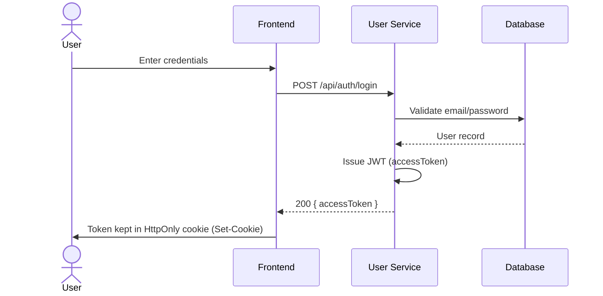

### Auth — Register
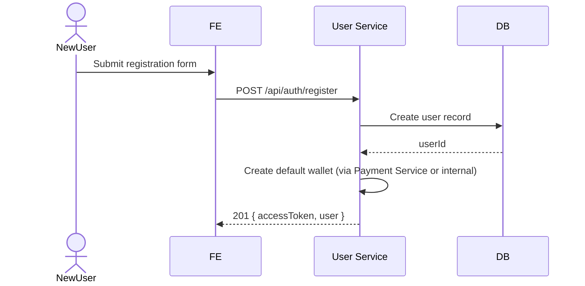

### Token Refresh 
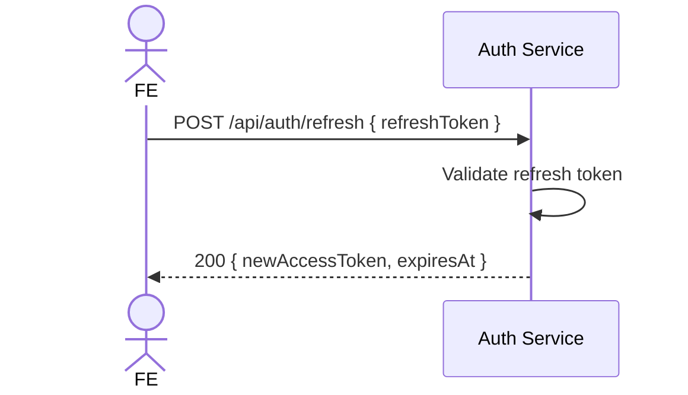

### Transfer (P2P) with Idempotency
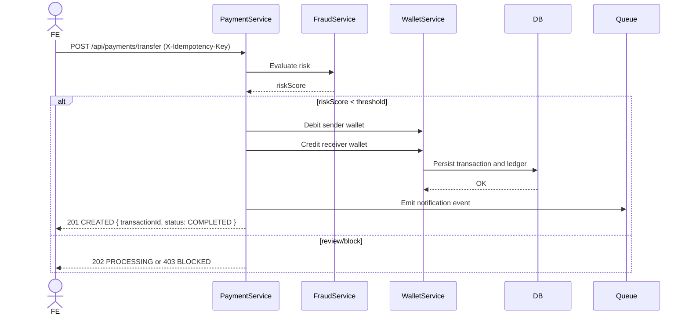

### Idempotent Retry (same key)
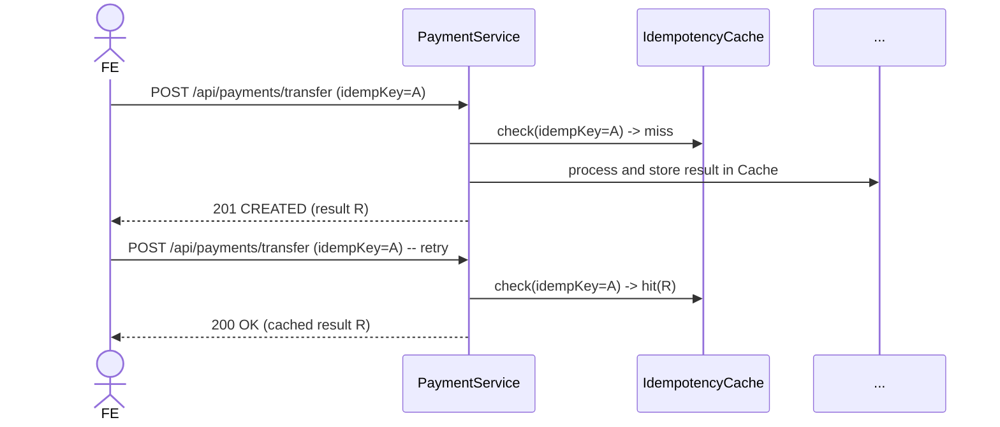

### Wallet — Create & Get Balance
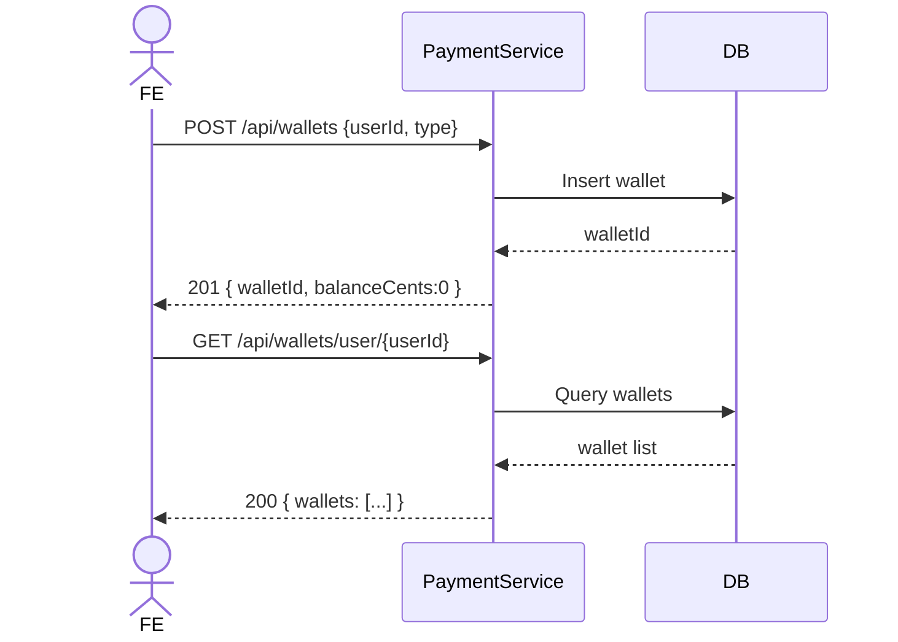

### Wallet — Freeze / Unfreeze (admin)
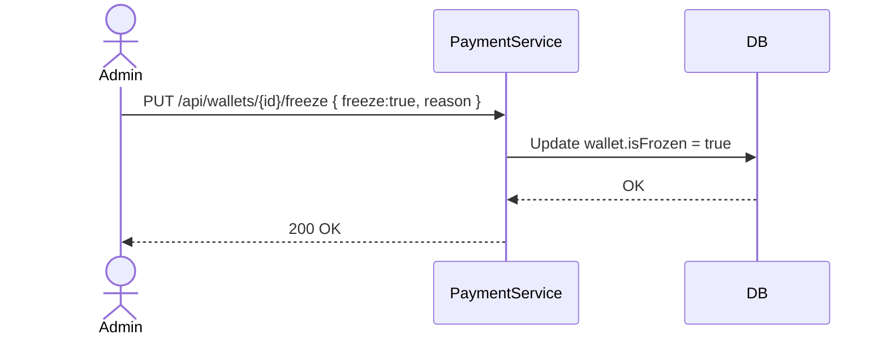

### KYC — Upload & Approve
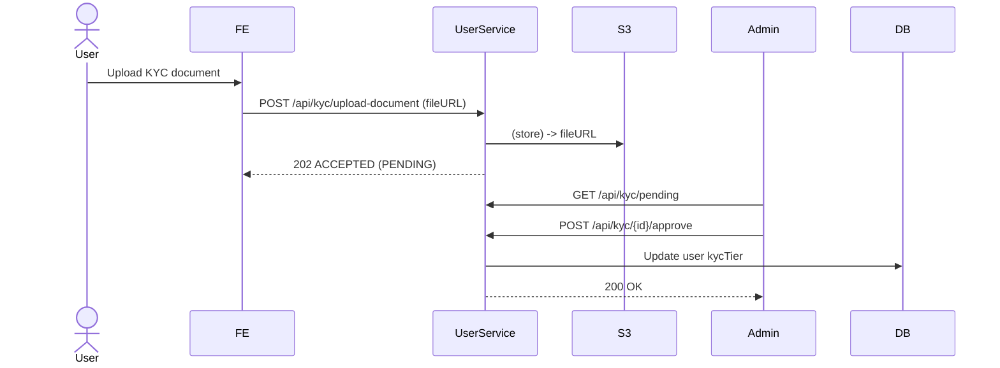

### Notification Processing (async)
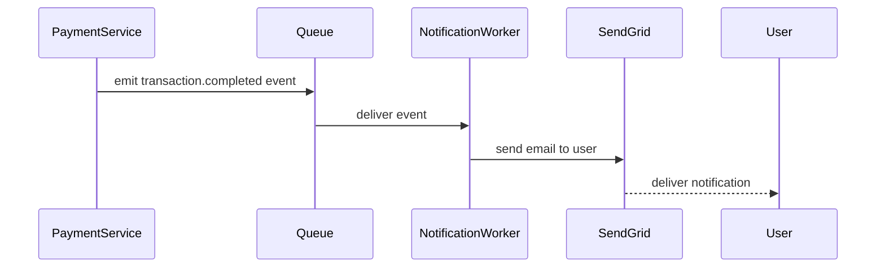

### Transaction Detail / History
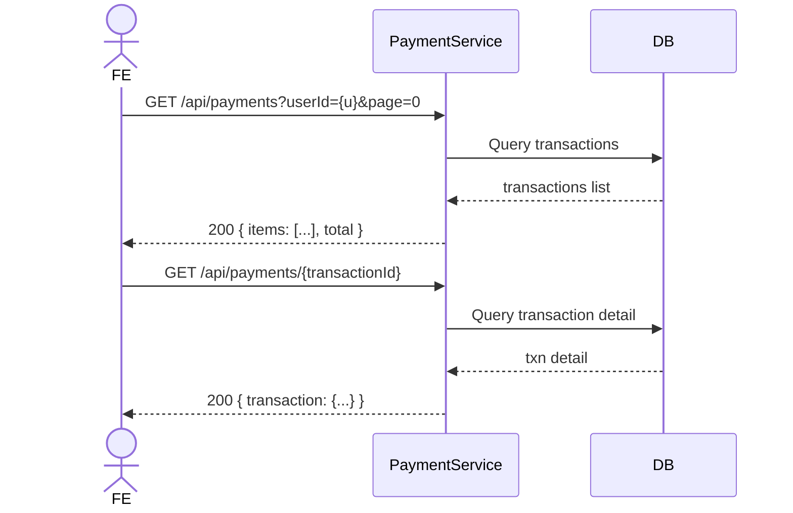

### End of API sequence diagrams

### Class Diagram (Backend)

**📍 INSERT HERE: UML Class Diagram**

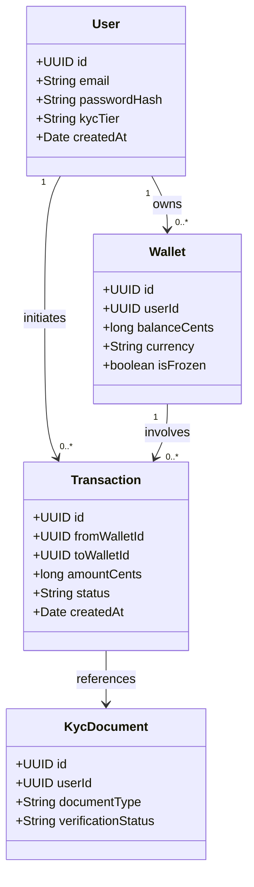

Should include:
- User, Wallet, Transaction, KycDocument, Contact, SuspiciousActivityReport entities
- Service classes (AuthService, UserService, TransactionService, WalletService, FraudDetectionService)
- Controller classes
- Repository interfaces
- DTOs and enums

### Frontend Architecture

```
src/
├── pages/
│   ├── LoginPage.tsx
│   ├── RegisterPage.tsx
│   ├── DashboardPage.tsx
│   ├── TransferPage.tsx
│   ├── TransactionHistoryPage.tsx
│   ├── ProfilePage.tsx
│   └── KycPage.tsx
├── components/
│   ├── Navigation.tsx
│   ├── WalletCard.tsx
│   ├── TransactionList.tsx
│   ├── TransferForm.tsx
│   ├── KycUpload.tsx
│   └── UserProfile.tsx
├── services/
│   ├── userServiceClient.ts
│   ├── paymentServiceClient.ts
│   ├── authService.ts
│   └── mockData.ts
├── context/
│   ├── AuthContext.tsx
│   └── AppContext.tsx
├── hooks/
│   ├── useAuth.ts
│   ├── useWallet.ts
│   ├── useTransactions.ts
│   └── useUserLimits.ts
├── types/
│   ├── user.types.ts
│   ├── payment.types.ts
│   └── common.types.ts
└── styles/
    └── tailwind.css

**Static pages → API flow (login/register/dashboard)**

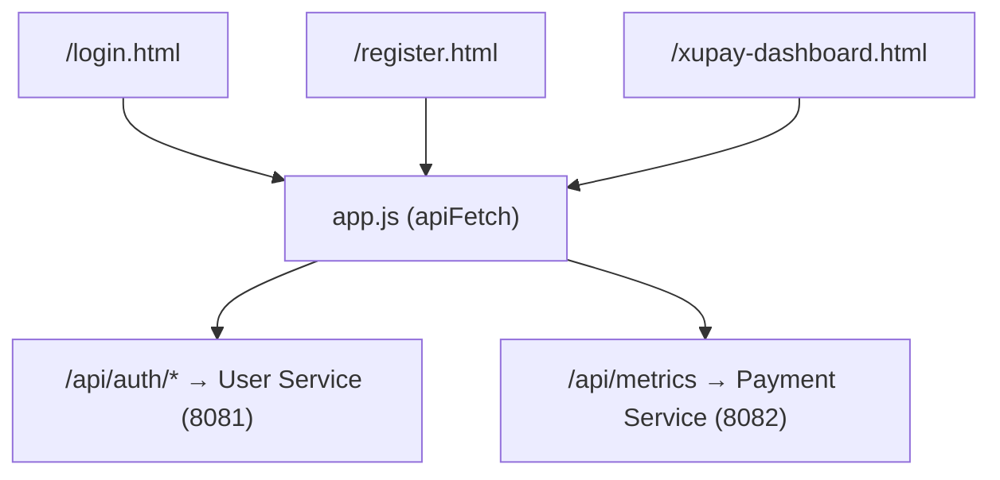

---

## Frontend Architecture Diagram & Notes 🔧

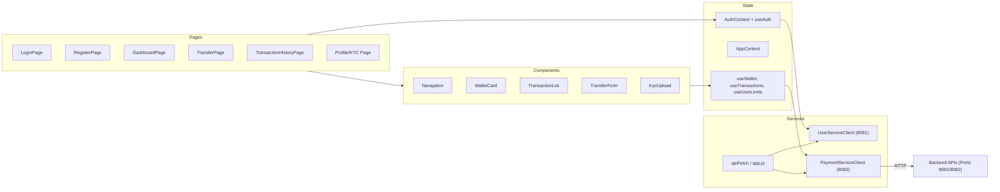

Highlights:
- **Auth & state**: `AuthContext` stores token and user state; `apiFetch` injects Authorization header and centralizes error handling. 🔐
- **Data flow**: Components use hooks (`useWallet`, `useTransactions`) which call service clients that target Payment/User services (HTTP). 🔁
- **Offline/dev support**: Dev server proxies `/api/auth/*` to 8081 and other `/api/*` to 8082; mocks can stand in for services during testing. 🧪
- **Testing & quality**: Unit for components, integration for hooks/clients, E2E for flows (login → transfer → history). ✅

If you want, I can also: add an SVG export of this diagram to `report/diagrams/`, or generate a short one-page frontend architecture summary (A4) suitable for printing.
```

---

# III. IMPLEMENTATION

## 1. USER SERVICE IMPLEMENTATION

### Authentication Functions

#### Register New Account

**Endpoint:** `POST /api/auth/register`

**Request:**
```typescript
{
  email: "user@example.com",
  password: "SecurePass123!",
  firstName: "John",
  lastName: "Doe",
  phone: "+84901234567"
}
```

**Response (201 Created):**
```typescript
{
  accessToken: "eyJhbGciOiJIUzI1NiIsInR5cCI6IkpXVCJ9...",
  expiresAt: "2025-12-28T10:00:00Z",
  user: {
    id: "550e8400-e29b-41d4-a716-446655440000",
    email: "user@example.com",
    firstName: "John",
    lastName: "Doe",
    kycStatus: "PENDING",
    kycTier: "TIER_0",
    isActive: true,
    createdAt: "2025-12-21T10:00:00Z"
  }
}
```

**Implementation Details:**
- Password hashing using BCrypt
- Email validation with regex
- Unique email constraint at database level
- Default personal wallet created automatically
- Initial KYC tier: TIER_0 (lowest limits)
- JWT token generation with 1-hour expiry

**📍 INSERT HERE: Code snippet of Register endpoint**

```java
@RestController
@RequestMapping("/api/auth")
public class AuthController {

    private final UserRepository userRepo;
    private final WalletClient walletClient; // call to payment service (create default wallet)
    private final PasswordEncoder passwordEncoder;
    private final JwtService jwtService;

    public AuthController(UserRepository userRepo, WalletClient walletClient, PasswordEncoder passwordEncoder, JwtService jwtService) {
        this.userRepo = userRepo;
        this.walletClient = walletClient;
        this.passwordEncoder = passwordEncoder;
        this.jwtService = jwtService;
    }

    @PostMapping("/register")
    public ResponseEntity<?> register(@RequestBody RegisterRequest req) {
        if (userRepo.existsByEmail(req.getEmail())) {
            return ResponseEntity.status(HttpStatus.CONFLICT).body("Email already in use");
        }

        // Hash password
        String hashed = passwordEncoder.encode(req.getPassword());

        User user = new User();
        user.setEmail(req.getEmail());
        user.setPasswordHash(hashed);
        user.setFirstName(req.getFirstName());
        user.setLastName(req.getLastName());
        user.setKycTier(KycTier.TIER_0);
        user = userRepo.save(user);

        // Create default wallet (synchronous call to Payment Service)
        try {
            CreateWalletRequest cw = new CreateWalletRequest(user.getId(), WalletType.PERSONAL, "VND");
            CreateWalletResponse wr = walletClient.createWallet(cw);
            // attach wallet id to user or log for audit
        } catch (Exception e) {
            // non-fatal: log and continue (depends on business requirement)
        }

        // Issue JWT
        String token = jwtService.issueToken(user.getId().toString(), user.getEmail());

        RegisterResponse resp = new RegisterResponse(token, Instant.now().plus(1, ChronoUnit.HOURS), new UserDto(user));
        return ResponseEntity.status(HttpStatus.CREATED).body(resp);
    }
}
```

Notes:
- `PasswordEncoder` is a `BCryptPasswordEncoder` bean.
- `WalletClient` can be a Feign/Rest client that calls `POST /api/wallets` to provision the default wallet.
- `JwtService` encapsulates token creation and expiry.
- Add input validation (email format, password strength) and transactional behavior if wallet creation must be atomic.

#### User Login

**Endpoint:** `POST /api/auth/login`

**Request:**
```typescript
{
  email: "user@example.com",
  password: "SecurePass123!"
}
```

**Response (200 OK):**
```typescript
{
  accessToken: "eyJhbGciOiJIUzI1NiIsInR5cCI6IkpXVCJ9...",
  expiresAt: "2025-12-28T10:00:00Z",
  user: { /* user object */ }
}
```

**Implementation:**
- Email and password validation
- Password verification against hashed value
- JWT token generation
- Token stored in an HttpOnly, SameSite=Strict cookie set by the server
- Automatic token refresh mechanism (optional)

**📍 INSERT HERE: Login flow diagram showing:**

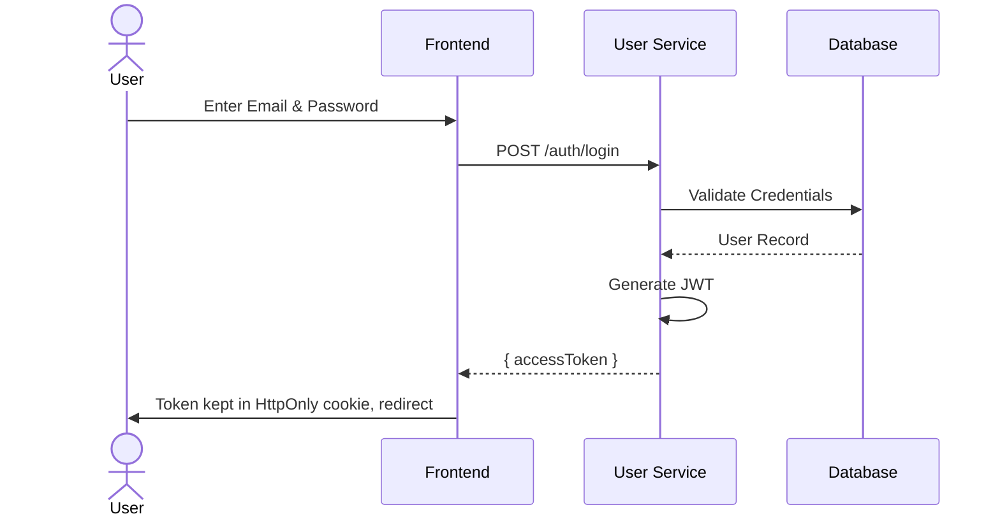

- Client sends credentials
- Server validates against database
- JWT generation
- Token sent back to client

#### KYC Document Upload & Verification

**Endpoint:** `POST /api/kyc/upload-document`

**Request:**
```typescript
{
  documentType: "PASSPORT",
  documentNumber: "P1234567",
  documentCountry: "USA",
  fileUrl: "https://s3.amazonaws.com/bucket/passport.jpg"
}
```

**Response (201 Created):**
```typescript
{
  id: "44444444-4444-4444-4444-444444444444",
  userId: "550e8400-e29b-41d4-a716-446655440000",
  documentType: "PASSPORT",
  documentNumber: "P1234567",
  verificationStatus: "PENDING",
  fileUrl: "https://s3.amazonaws.com/bucket/passport.jpg",
  createdAt: "2025-12-21T10:00:00Z"
}
```

**Implementation:**
- File validation (size, format, dimensions)
- S3 URL storage (no file download from browser)
- Verification workflow:
  - PENDING → Manual admin review
  - APPROVED → KYC tier upgrades, limits increase
  - REJECTED → User can resubmit

**KYC Tier System:**
| Tier | Daily Send | Single Tx Max | Monthly Volume | International |
|------|-----------|---------------|----------------|---------------|
| TIER_0 | $100 | $50 | $1,000 | ❌ |
| TIER_1 | $1,000 | $500 | $20,000 | ❌ |
| TIER_2 | $10,000 | $5,000 | $200,000 | ✅ |
| TIER_3 | $100,000 | $50,000 | $1,000,000 | ✅ |

### Profile Management

**Get User Profile:**
```
GET /api/users/me/profile
Response: { id, email, firstName, lastName, phone, kycStatus, kycTier, fraudScore, createdAt }
```

**Update Profile:**
```
PUT /api/users/me/profile
Request: { firstName?, lastName?, phone?, dateOfBirth?, nationality? }
Response: Updated profile object
```

### Transaction Limits

**Get Limits:**
```
GET /api/users/me/limits
Response: { dailySendLimit, dailyReceiveLimit, singleTransactionMax, monthlyVolumeLimit, ... }
```

**Check Limit:**
```
POST /api/users/me/check-limit
Request: { amountCents: 100000, type: "send" }
Response: { allowed: true, remainingDailyCents: 900000 }
```

**Get Daily Usage:**
```
GET /api/users/me/daily-usage
Response: { userId, usageDate, totalSentCents, totalSentCount, totalReceivedCents, ... }
```

## 2. PAYMENT SERVICE IMPLEMENTATION

### Wallet Management

#### Create Wallet

**Endpoint:** `POST /api/wallets`

**Request:**
```typescript
{
  userId: "550e8400-e29b-41d4-a716-446655440000",
  walletType: "PERSONAL",  // or BUSINESS, MERCHANT
  currency: "VND"
}
```

**Response (201 Created):**
```typescript
{
  walletId: "bbbbbbbb-bbbb-bbbb-bbbb-bbbbbbbbbbbb",
  userId: "550e8400-e29b-41d4-a716-446655440000",
  glAccountCode: "GL-2110-PERSONAL-001",
  walletType: "PERSONAL",
  currency: "VND",
  balanceCents: 0,  // cents, not dollars
  isActive: true,
  createdAt: "2025-12-21T11:05:00Z"
}
```

**Implementation:**
- GL (General Ledger) account code generated automatically
- Balance stored in cents to avoid floating-point errors
- Wallet status (active/inactive/frozen)
- Multiple wallets per user supported

**📍 INSERT HERE: Wallet creation screenshot**

#### Get Wallet Balance

**Endpoint:** `GET /api/wallets/{walletId}/balance`

**Response:**
```typescript
{
  walletId: "bbbbbbbb-bbbb-bbbb-bbbb-bbbbbbbbbbbb",
  userId: "550e8400-e29b-41d4-a716-446655440000",
  balanceCents: 5000000,  // 50,000 VND
  balanceAmount: 50000,
  currency: "VND",
  isActive: true,
  isFrozen: false
}
```

#### Freeze Wallet (Admin)

**Endpoint:** `PUT /api/wallets/{walletId}/freeze`

**Request:**
```typescript
{
  freeze: true,
  reason: "Suspicious activity detected - fraud score 85%"
}
```

**Response:** `200 OK`

**Implementation:**
- Admin-only action
- Used when fraud detected or investigation needed
- Prevents all transactions from/to wallet
- Notification sent to user

### Transfer Implementation

#### Fund Transfer (P2P)

**Endpoint:** `POST /api/payments/transfer`

**Request:**
```typescript
{
  idempotencyKey: "550e8400-e29b-41d4-a716-446655440123",  // UUID for retry safety
  fromUserId: "550e8400-e29b-41d4-a716-446655440001",
  toUserId: "550e8400-e29b-41d4-a716-446655440002",
  amountCents: 100000,  // 1,000 VND
  description: "Payment for lunch",
  ipAddress: "192.168.1.1",
  userAgent: "Mozilla/5.0..."
}
```

**Response (201 Created or 200 Processing):**
```typescript
{
  transactionId: "aaaaaaaa-aaaa-aaaa-aaaa-aaaaaaaaaaaa",
  idempotencyKey: "550e8400-e29b-41d4-a716-446655440123",
  fromUserId: "550e8400-e29b-41d4-a716-446655440001",
  toUserId: "550e8400-e29b-41d4-a716-446655440002",
  amountCents: 100000,
  amount: 1000,
  currency: "VND",
  status: "COMPLETED",  // or PROCESSING, FAILED, BLOCKED, REVIEW
  createdAt: "2025-12-21T15:30:00Z"
}
```

**Transfer Workflow:**
```
1. Receive request
   ↓
2. Check idempotency key (already processed?)
   ├─ YES → Return cached result
   └─ NO → Continue
   ↓
3. Validate request (amounts, users exist)
   ↓
4. Check KYC limits
   ├─ Exceeded → FAILED
   └─ OK → Continue
   ↓
5. Check daily usage limits
   ├─ Exceeded → FAILED
   └─ OK → Continue
   ↓
6. Run fraud detection
   ├─ ALLOW → Execute transfer
   ├─ REVIEW → Mark as PROCESSING, create SAR
   └─ BLOCK → FAILED, create SAR
   ↓
7. Execute transfer (debit/credit with transaction)
   ↓
8. Cache result with idempotency key
   ↓
9. Send notifications (if enabled)
```

**📍 INSERT HERE: Transfer flow sequence diagram**

```mermaid
sequenceDiagram
    participant Client
    participant FE
    participant API as PaymentService
    participant Fraud as FraudService
    participant Wallet as WalletService
    participant DB
    participant Queue

    Client->>FE: Fill transfer form & submit (idempotencyKey)
    FE->>API: POST /api/payments/transfer
    API->>Fraud: Assess risk signals
    Fraud-->>API: Risk score
    API->>Wallet: Debit sender wallet
    API->>Wallet: Credit receiver wallet
    Wallet->>DB: Persist transaction
    DB-->>Wallet: OK
    API->>Queue: Emit notification event
    API-->>FE: 201 CREATED / PROCESSING
```

- Show request validation
- Show fraud detection
- Show database updates
- Show response

### Fraud Detection

**Fraud Detection Service:**
```typescript
interface FraudSignals {
  userId: string;
  transactionAmount: number;
  userAverageAmount: number;  // Historical average
  isUnusualSize: boolean;
  isHighFrequency: boolean;
  isNewRecipient: boolean;
  timeOfDay: string;  // Morning/afternoon/night
  dayOfWeek: string;  // Weekday vs weekend
  ipAddressIsNew: boolean;
  geolocationChange: boolean;
}

// Risk scoring (0-100)
// 0-30: ALLOW
// 30-70: REVIEW (manual approval)
// 70-100: BLOCK
```

**Suspicious Activity Report (SAR):**
- Created for medium to high-risk transactions
- Admin can review and take action
- Audit trail for compliance

**📍 INSERT HERE: Fraud detection rules table**

| Rule ID | Risk Factor | Description | Signal Sources | Weight (0-100) | Example Signal | Action if triggered |
|---------|-------------|-------------|----------------|----------------|----------------|---------------------|
| R1 | Transaction amount (relative to user avg) | Amount > n * user's avg transaction amount | transaction.amount, historical avg | 25 | amount = 10x user avg | +25 points
| R2 | Transaction amount (absolute) | Amount exceeds user's KYC tier single tx limit | transaction.amount, user.kycTier | 30 | amount > TIER_1 max | +30 points
| R3 | New recipient / first time payee | Recipient never seen for this user | recipientId, user tx history | 15 | toUserId not in user's contacts | +15 points
| R4 | High frequency | Number of sends in short window > threshold | user send rate, time window | 20 | 10 tx in 1 hour | +20 points
| R5 | Velocity across accounts | Multiple outbound txs to different recipients rapidly | outgoing tx patterns | 20 | 5 different recipients in 10 min | +20 points
| R6 | IP risk / geolocation change | IP geolocation differs from usual pattern significantly | ipAddress, geolocation DB | 15 | login IP = new country | +15 points
| R7 | Device / User-Agent anomaly | New or rare device / UA compared to baseline | userAgent, deviceId | 10 | new device fingerprint | +10 points
| R8 | Blacklisted recipient | Recipient present in denylist | recipientId lookup | 50 | recipient in blacklist | +50 points (auto-block)
| R9 | Suspicious metadata | Strange description patterns, repeated test amounts | description, pattern matching | 10 | repeated identical amounts & text | +10 points
| R10 | Failed authentication attempts | Recent failed logins before transfer | auth logs | 20 | 3 failed logins in 5 min | +20 points

**Scoring thresholds & recommended actions**
- **0–29**: ALLOW — proceed with normal processing.
- **30–69**: REVIEW — mark transaction as PROCESSING, create a Suspicious Activity Report (SAR), notify fraud team for manual review; possibly require additional verification (2FA, KYC upgrade).
- **70–100**: BLOCK — reject the transaction, create incident record and SAR, freeze related wallets as necessary and notify user/admin immediately.

**Example scenarios**
- High-risk example: R2 (30) + R3 (15) + R6 (15) = 60 → REVIEW (PROCESSING + SAR).
- Block example: R8 (50) + R1 (25) = 75 → BLOCK (reject + SAR + admin alert).
- Allow example: R1 (10) + R7 (5) = 15 → ALLOW.

**Implementation & operational notes**
- Store rules in DB (FraudRule table) to allow runtime tuning without deploys; evaluate rules in a pipeline that sums weights into a risk score.
- Use Redis or low-latency cache for historical lookups (avg amounts, recent tx counts) for performance.
- Ensure idempotency: when a transaction is retried, reuse stored risk assessment to avoid double-reporting.
- Logging/audit: persist full risk signals, scores, rule matches and action taken for compliance and for model tuning.
- Monitoring: create alerts for surge in REVIEW/BLOCK rates and provide dashboard for fraud analysts.

**Test cases (recommended)**
- Unit tests for each rule producing expected weight given synthetic signal inputs.
- Integration tests: simulated sequences that sum to ALLOW/REVIEW/BLOCK across typical user profiles.
- E2E: simulate retries with same idempotency key and ensure the risk assessment/result is stable.

**Notes:** adjust weights and thresholds based on production telemetry; start conservative (favor REVIEW over BLOCK) and tighten rules after tuning.

### Idempotency Implementation

**Concept:** Prevent duplicate transactions on network retry

**Implementation:**
```typescript
// Request includes idempotencyKey (UUID)
POST /api/payments/transfer
{
  idempotencyKey: "550e8400-e29b-41d4-a716-446655440123",
  ...
}

// Server stores: idempotencyKey → TransactionId mapping
// On retry with same key: Return cached result
// Safe to retry without duplicate charge
```

**Storage:** Redis with TTL (24 hours)
**Benefit:** Client can safely retry if network timeout occurs

### Transaction History

**List Transactions:**
```
GET /api/payments?userId={uuid}&page=0&size=20
Response: {
  items: [
    { transactionId, status, amountCents, currency, description, createdAt, ... },
    ...
  ],
  total: 145
}
```

**Get Transaction Detail:**
```
GET /api/payments/{transactionId}
Response: {
  transactionId, type, status, amountCents, currency,
  description, createdAt, completedAt, fraudScore, ...
}
```

## 3. FRONTEND INTEGRATION

### Authentication Context

**📍 INSERT HERE: React Context example code**

```typescript
// AuthContext.tsx
interface AuthContextType {
  user: User | null;
  token: string | null;
  isLoading: boolean;
  login: (email: string, password: string) => Promise<void>;
  register: (data: RegisterRequest) => Promise<void>;
  logout: () => void;
  isAuthenticated: boolean;
}

// Usage in components:
const { user, isAuthenticated, logout } = useAuth();
```

### API Service Integration

**User Service Client:**
```typescript
import { getUserServiceClient } from '@/services/userServiceClient';

const userClient = getUserServiceClient();
const profile = await userClient.getMyProfile();
const limits = await userClient.getMyLimits();
```

**Payment Service Client:**
```typescript
import { getPaymentServiceClient } from '@/services/paymentServiceClient';

const paymentClient = getPaymentServiceClient();
const transfer = await paymentClient.transfer({
  idempotencyKey: generateUUID(),
  fromUserId: currentUser.id,
  toUserId: recipientId,
  amountCents: amount * 100,
  description: "Payment"
});
```

### Key Pages

#### Login Page
**📍 INSERT HERE: Login page screenshot**
- Email input
- Password input
- Submit button
- "Register" link
- Error messages

#### Dashboard
**📍 INSERT HERE: Dashboard screenshot**
- User info (name, KYC tier)
- Wallet balance
- Recent transactions
- Quick action buttons (Transfer, View History, Profile)

#### Transfer Page
**📍 INSERT HERE: Transfer page screenshot**
- Recipient selection
- Amount input
- Description
- Submit button
- Real-time limit checking

#### Transaction History
**📍 INSERT HERE: Transaction history page screenshot**
- List of transactions
- Filter/search options
- Transaction details modal
- Status indicators

#### Profile & KYC
**📍 INSERT HERE: Profile management screenshot**
- User information form
- KYC tier display
- Document upload
- Verification status

### Error Handling

**📍 INSERT HERE: Error handling screenshot**
- Example API error message
- Form validation error
- Network error handling

---

# IV. DISCUSSION AND CONCLUSION

## Achievements

✅ Completed user authentication with JWT
✅ Implemented secure wallet management
✅ Built P2P transfer system with idempotency
✅ Integrated fraud detection
✅ Created comprehensive KYC verification flow
✅ Deployed with Docker and Docker Compose
✅ Developed responsive React frontend
✅ Comprehensive API documentation

## Challenges & Solutions

### Challenge 1: Floating-Point Precision in Financial Calculations
**Problem:** Double arithmetic causes rounding errors
**Solution:** Stored all amounts in cents (integers) to avoid floating-point operations

### Challenge 2: Concurrent Transaction Handling
**Problem:** Race conditions when processing simultaneous transfers
**Solution:** Database transactions with proper isolation levels

### Challenge 3: API Integration Complexity
**Problem:** Coordinating multiple microservices
**Solution:** Clear API contracts and synchronous service-to-service calls where needed

### Challenge 4: Fraud Detection Accuracy
**Problem:** Balancing false positives vs false negatives
**Solution:** Configurable risk thresholds with manual review capability

## Future Enhancements

1. **Webhook Notifications**: Real-time push notifications for transactions
2. **Mobile App**: Native iOS/Android applications
3. **Payment Methods**: Credit card, bank transfer integration
4. **Scheduled Transfers**: Recurring payments, bill pay
5. **Advanced Analytics**: Spending patterns, financial insights
6. **Multi-Currency**: Cross-border transfers with FX
7. **API Rate Limiting**: Protection against abuse
8. **Two-Factor Authentication**: Enhanced security
9. **Transaction Reversal**: Refund/chargeback handling
10. **Audit Logging**: Comprehensive compliance audit trail

## Lessons Learned

- **Microservices Architecture**: Benefits of separation of concerns and independent scaling
- **Security First**: Importance of JWT, password hashing, and input validation
- **Testing**: Unit, integration, and end-to-end testing essential for financial systems
- **API Design**: RESTful conventions and clear contracts enable better integration
- **Database Design**: Proper schema, indexes, and constraints prevent bugs
- **DevOps**: Docker/Docker Compose streamline development and deployment

## Conclusion

XUPay demonstrates a modern, scalable payment service architecture following industry best practices. The implementation showcases:

- **Robust backend** with Spring Boot microservices
- **Secure authentication** using JWT and role-based access control
- **Compliant financial processing** with idempotency and fraud detection
- **Responsive frontend** built with React and TypeScript
- **Production-ready infrastructure** with Docker containerization

This project provides a solid foundation for a real-world fintech platform and demonstrates the team's understanding of full-stack development, system design, and financial software requirements.

---

# V. REFERENCE

[1] Spring Boot Official Documentation. "Spring Boot Reference Documentation." https://spring.io/projects/spring-boot

[2] React Documentation. "React - A JavaScript library for building user interfaces." https://react.dev

[3] PostgreSQL. "PostgreSQL: The World's Most Advanced Open Source Relational Database." https://www.postgresql.org/docs/

[4] Redis. "Redis - The Real-time Data Platform." https://redis.io/docs/

[5] JWT.io. "JSON Web Tokens - JWT.io." https://jwt.io/introduction

[6] Docker. "Docker - Build, Ship, and Run Applications." https://docs.docker.com/

[7] OWASP. "OWASP Top 10 - 2021 Update." https://owasp.org/Top10/

[8] PCI Security Standards Council. "PCI DSS Compliance Guide." https://www.pcisecuritystandards.org/

[9] RESTful API Guidelines. "Microsoft REST API Guidelines." https://github.com/microsoft/api-guidelines

[10] Google Cloud. "Google Cloud Best Practices for API Security." https://cloud.google.com/docs/authentication

---

## Appendix A: API Documentation Summary

### User Service Endpoints
- `POST /api/auth/register` - Register new account
- `POST /api/auth/login` - User login
- `GET /api/users/me/profile` - Get user profile
- `PUT /api/users/me/profile` - Update profile
- `GET /api/users/me/limits` - Get transaction limits
- `POST /api/users/me/check-limit` - Check limit for transfer
- `POST /api/kyc/upload-document` - Upload KYC document

### Payment Service Endpoints
- `POST /api/payments/transfer` - Create transfer
- `GET /api/payments/{transactionId}` - Get transaction details
- `GET /api/payments` - List transactions
- `POST /api/wallets` - Create wallet
- `GET /api/wallets/user/{userId}` - Get user wallet
- `GET /api/wallets/{walletId}/balance` - Check balance
- `PUT /api/wallets/{walletId}/freeze` - Freeze wallet

---

**End of Report**

*Generated: December 22, 2025*
*Project: XUPay Payment Service System*