# 📊 XUPay System - Optimized Diagrams (ONE Screenshot Each)

All diagrams fitted to single screen - NO SCROLLING NEEDED! ✅

> **💡 TIP**: Use https://mermaid.live to view each diagram as ONE complete image.

---


## 🎯 QUICK START

1. Copy diagram code
2. Go to https://mermaid.live
3. Paste in left editor
4. RIGHT SIDE = Complete diagram (no scroll!)
5. Screenshot!

---

## 📊 DIAGRAM 1: System Architecture

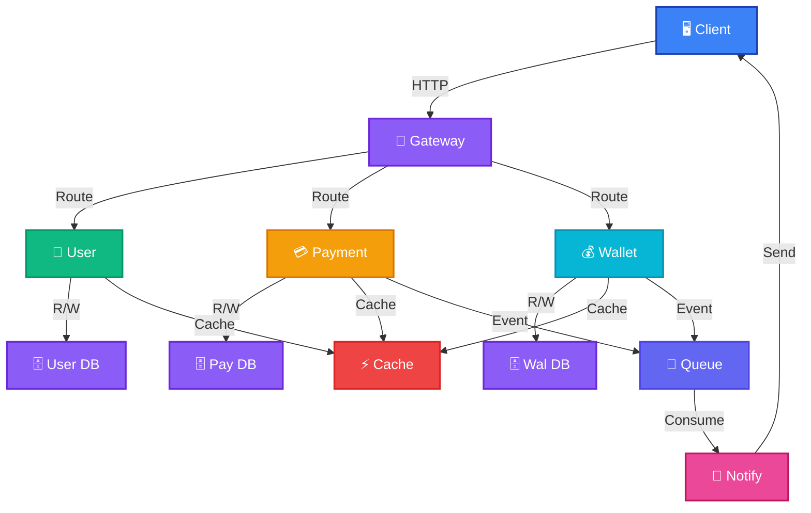

---

## 📱 DIAGRAM 2: User Login Flow

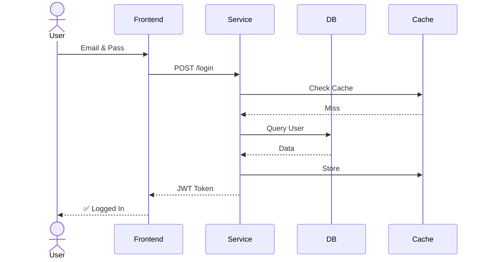

---

## 💳 DIAGRAM 3: Payment Processing

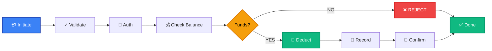

---

## 💰 DIAGRAM 4: Wallet States

```mermaid
erDiagram
    USERS {
        UUID id PK
        string email
        string phone
        string first_name
        string last_name
        date date_of_birth
        string nationality
        string password_hash
        string kyc_status
        string kyc_tier
        timestamptz kyc_verified_at
        UUID kyc_verified_by
        boolean is_active
        boolean is_suspended
        text suspension_reason
        int fraud_score
        inet ip_address_registration
        text user_agent_registration
        timestamptz created_at
        timestamptz updated_at
        timestamptz last_login_at
    }

    USER_PREFERENCES {
        UUID id PK
        UUID user_id FK UNIQUE
        string language
        string timezone
        string currency
        boolean notification_email
        boolean notification_sms
        boolean notification_push
        boolean two_factor_enabled
        string two_factor_method
        boolean biometric_enabled
        boolean auto_topup_enabled
        long auto_topup_threshold_cents
        long auto_topup_amount_cents
        string theme
        timestamptz created_at
        timestamptz updated_at
    }

    USER_CONTACTS {
        UUID id PK
        UUID user_id FK
        UUID contact_user_id FK
        string nickname
        int total_transactions
        timestamptz last_transaction_at
        boolean is_favorite
        timestamptz created_at
        timestamptz updated_at
    }

    KYC_DOCUMENTS {
        UUID id PK
        UUID user_id FK
        string document_type
        string document_number
        string document_country
        text file_url
        long file_size_bytes
        string mime_type
        string verification_status
        text verification_notes
        UUID verified_by
        timestamptz verified_at
        timestamptz expires_at
        jsonb extracted_data
        timestamptz created_at
        timestamptz updated_at
    }

    DAILY_USAGE {
        UUID id PK
        UUID user_id FK
        date usage_date
        long total_sent_cents
        int total_sent_count
        long total_received_cents
        int total_received_count
        jsonb hourly_sent_counts
        timestamptz created_at
        timestamptz updated_at
    }

    TRANSACTION_LIMITS {
        UUID id PK
        string tier_name UNIQUE
        long daily_send_limit_cents
        long daily_receive_limit_cents
        long single_transaction_max_cents
        long monthly_volume_limit_cents
        int max_transactions_per_day
        int max_transactions_per_hour
        boolean can_send_international
        boolean can_receive_merchant_payments
        timestamptz created_at
        timestamptz updated_at
    }

    WALLETS {
        UUID id PK
        UUID user_id          "user service (external) -- no DB FK"
        string gl_account_code FK
        string wallet_type
        string currency
        boolean is_active
        boolean is_frozen
        text freeze_reason
        datetime created_at
        datetime updated_at
    }

    TRANSACTIONS {
        UUID id PK
        UUID idempotency_key UNIQUE
        UUID from_wallet_id FK
        UUID to_wallet_id FK
        UUID from_user_id      "user service (external)"
        UUID to_user_id        "user service (external)"
        long amount_cents
        string currency
        string type
        string status
        text description
        string reference_number
        boolean is_flagged
        int fraud_score
        text fraud_reason
        string ip_address
        text user_agent
        boolean is_reversed
        UUID reversed_by_transaction_id
        text reversal_reason
        datetime created_at
        datetime completed_at
    }

    LEDGER_ENTRIES {
        UUID id PK
        UUID transaction_id FK
        string gl_account_code FK
        UUID wallet_id FK
        string entry_type
        long amount_cents
        text description
        boolean is_reversed
        UUID reversed_by_entry_id
        datetime created_at
    }

    CHART_OF_ACCOUNTS {
        UUID id PK
        string account_code UNIQUE
        string account_name
        string account_type
        string normal_balance
        string parent_account_code
        boolean is_active
        text description
        datetime created_at
        datetime updated_at
    }

    MERCHANTS {
        UUID id PK
        UUID user_id           "user service (external)"
        UUID wallet_id FK
        string business_name
        string business_registration_number
        string business_type
        decimal merchant_fee_percentage
        string settlement_frequency
        boolean is_active
        boolean is_verified
        datetime created_at
        datetime updated_at
    }

    IDEMPOTENCY_CACHE {
        UUID idempotency_key PK
        jsonb response_data
        UUID transaction_id
        datetime expires_at
        datetime created_at
    }

    FRAUD_RULES {
        UUID id PK
        string rule_name UNIQUE
        string rule_type
        jsonb parameters
        int risk_score_penalty
        string action
        boolean is_active
        datetime created_at
        datetime updated_at
    }

    %% Relationships
    USERS ||--|| USER_PREFERENCES : "has"
    USERS ||--o{ USER_CONTACTS : "owner"
    USER_CONTACTS }o--|| USERS : "contact_user"
    USERS ||--o{ KYC_DOCUMENTS : "uploads"
    USERS ||--o{ DAILY_USAGE : "daily_records"

    TRANSACTION_LIMITS ||--|| TRANSACTION_LIMITS : "config"  %% standalone config table (no FK relations)

    WALLETS }o--|| CHART_OF_ACCOUNTS : "gl_account ->"
    TRANSACTIONS ||--o{ LEDGER_ENTRIES : "creates"
    LEDGER_ENTRIES }o--|| CHART_OF_ACCOUNTS : "posts_to"
    WALLETS ||--o{ TRANSACTIONS : "from/to"
    MERCHANTS }o--|| WALLETS : "uses_wallet"
    MERCHANTS }o--|| USERS : "owner (external)"
    WALLETS }o..|| USERS : "owner (external, no FK)"
    TRANSACTIONS }o..|| USERS : "from/to (external)"
    IDEMPOTENCY_CACHE ||--|| TRANSACTIONS : "may reference"
    FRAUD_RULES ||--|| TRANSACTIONS : "applied_by (logical)"
    CHART_OF_ACCOUNTS }o--|| CHART_OF_ACCOUNTS : "parent_account"
```

---

## 🔐 DIAGRAM 6: Authentication Flow

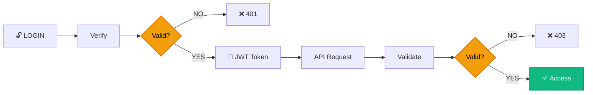

---

## 📝 DIAGRAM 7: Transaction Lifecycle

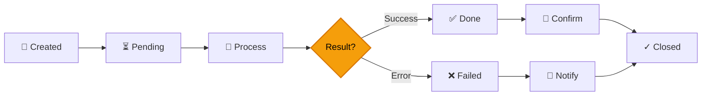

---

## 📊 DIAGRAM 8: KYC Tiers

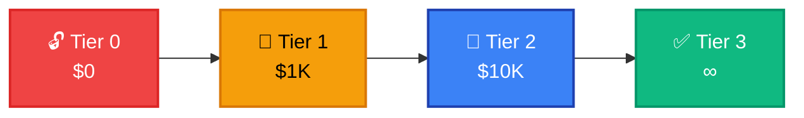

---

## 🌐 DIAGRAM 9: API Request/Response

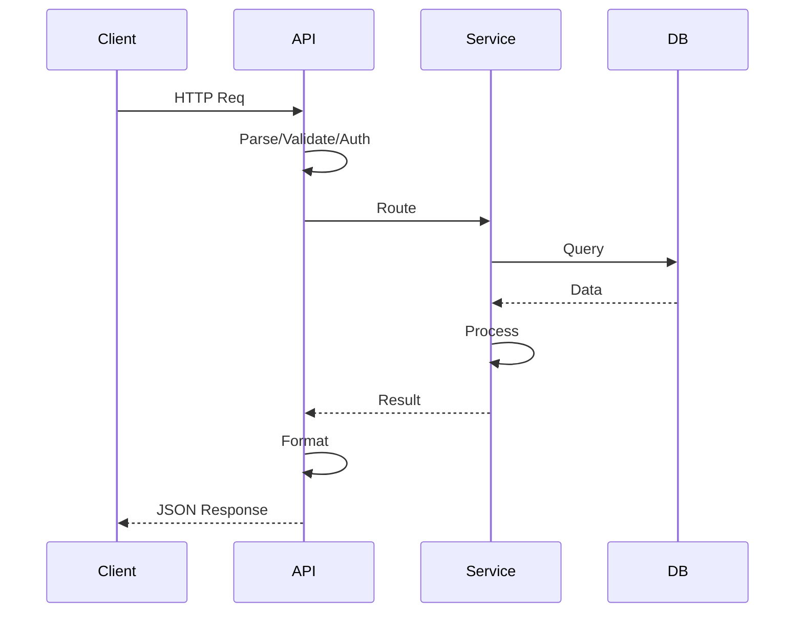

---

## 📧 DIAGRAM 10: Notification System

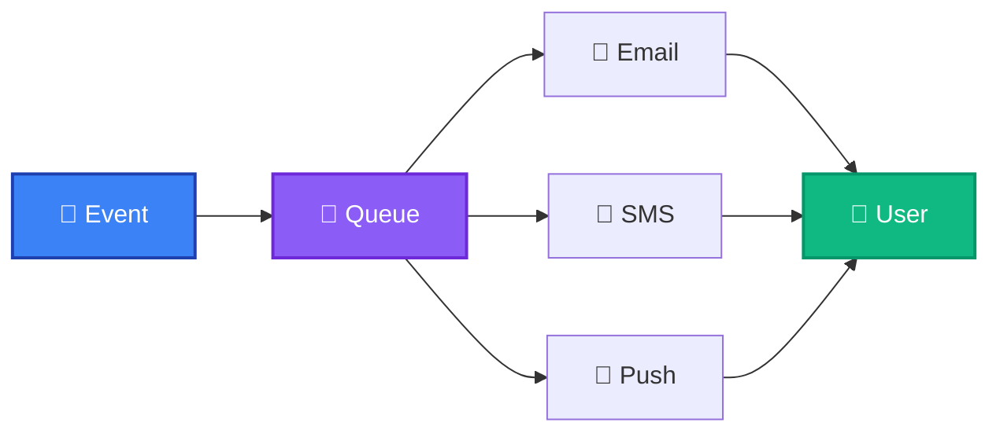

---

## ⚠️ DIAGRAM 11: Error Handling

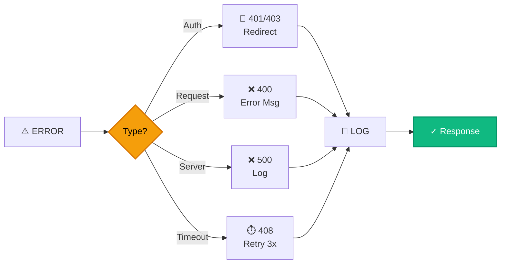

---

## 🛡️ DIAGRAM 12: Security Layers

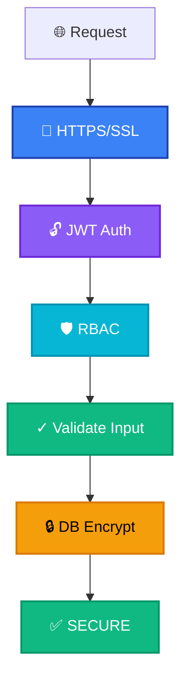

---

## 🚀 DIAGRAM 13: Deployment Architecture

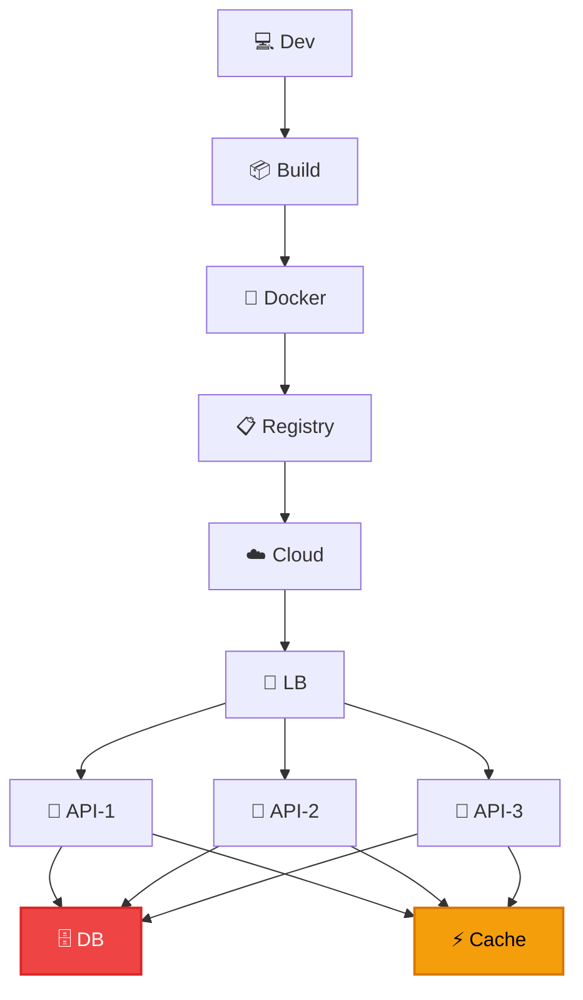

---

## 📈 DIAGRAM 14: Complete Data Flow

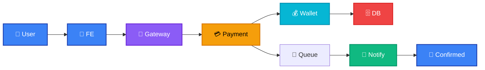

---

## 🧪 DIAGRAM 15: Testing Strategy

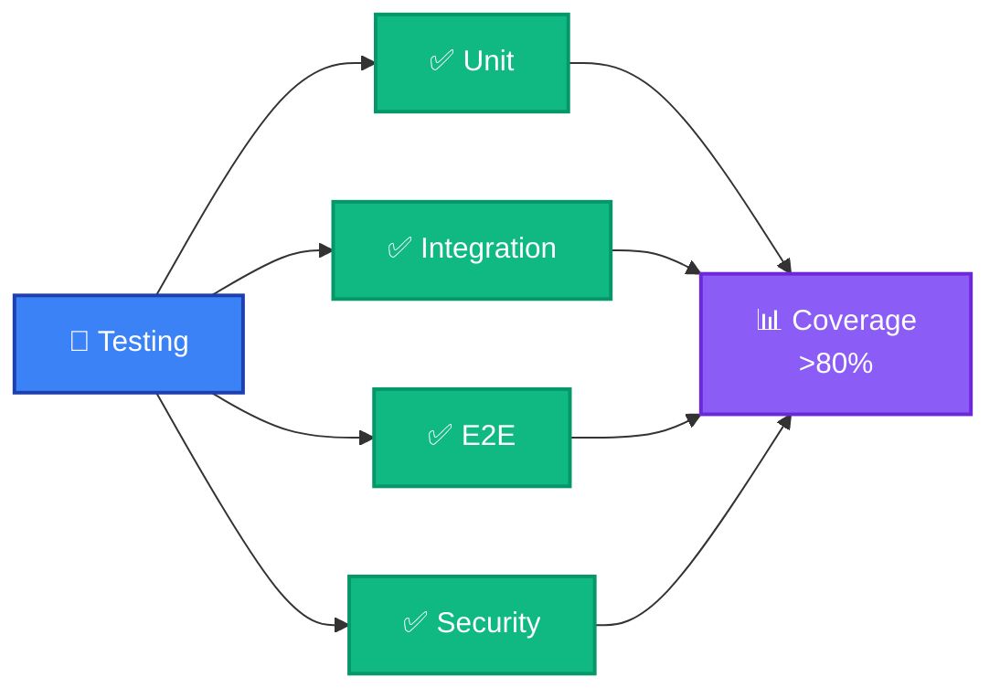

---

## 🎯 DIAGRAM 16: Agile Sprint Workflow

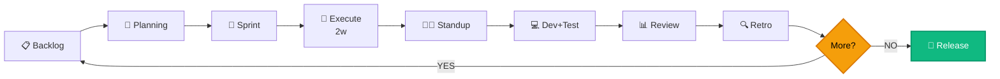

---

## 📅 DIAGRAM 17: Sprint Timeline

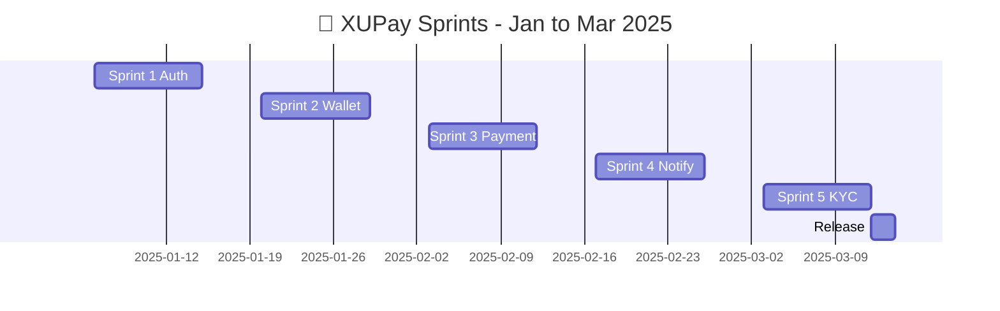

---

## 📊 DIAGRAM 18: User Story Board

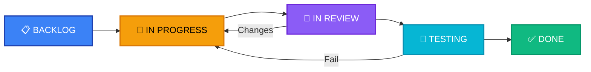

---

## 🚀 DIAGRAM 19: Release Process

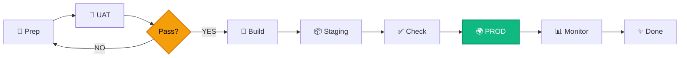

---

## 📈 DIAGRAM 20: Sprint Burndown

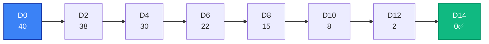

---

## 👥 DIAGRAM 21: Team Structure

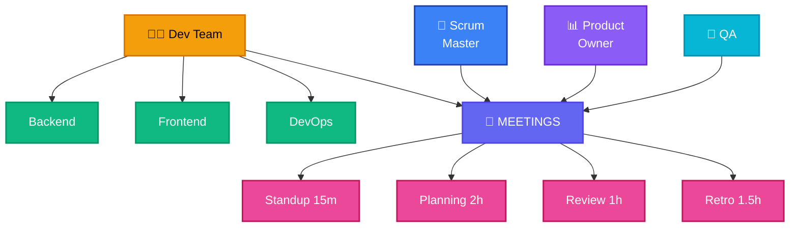

---

## ✅ ALL 21 DIAGRAMS - READY TO SCREENSHOT

| # | Diagram | Type |
|---|---------|------|
| 1 | System Architecture | Flow |
| 2 | User Login Flow | Sequence |
| 3 | Payment Processing | Flow |
| 4 | Wallet States | State |
| 5 | Database ERD | Database |
| 6 | Authentication | Flow |
| 7 | Transaction Lifecycle | Flow |
| 8 | KYC Tiers | Progression |
| 9 | API Cycle | Sequence |
| 10 | Notifications | Flow |
| 11 | Error Handling | Flow |
| 12 | Security Layers | Flow |
| 13 | Deployment | Architecture |
| 14 | Data Flow | Flow |
| 15 | Testing Strategy | Structure |
| 16 | Agile Process | Flow |
| 17 | Sprint Timeline | Gantt |
| 18 | Story Board | Flow |
| 19 | Release Process | Flow |
| 20 | Burndown Chart | Progression |
| 21 | Team Structure | Organization |

---

## 🎯 HOW TO USE

1. **Copy diagram code**
2. **Go to https://mermaid.live**
3. **Paste in left side**
4. **Screenshot right side** = COMPLETE diagram (no scroll!)
5. **Insert in report**

✅ **Each diagram fits in ONE screenshot!**

---

**Generated**: December 23, 2025
**System**: XUPay Payment Service System  
**Version**: 4.0 - Optimized for Single Screenshot

All diagrams optimized to fit within mermaid.live viewport 🎉
