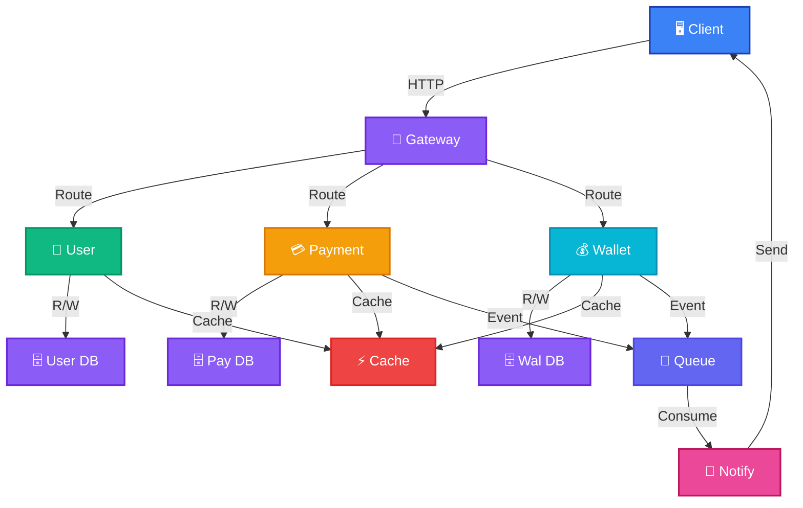
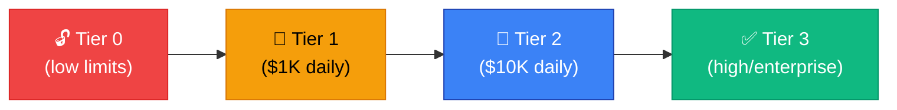
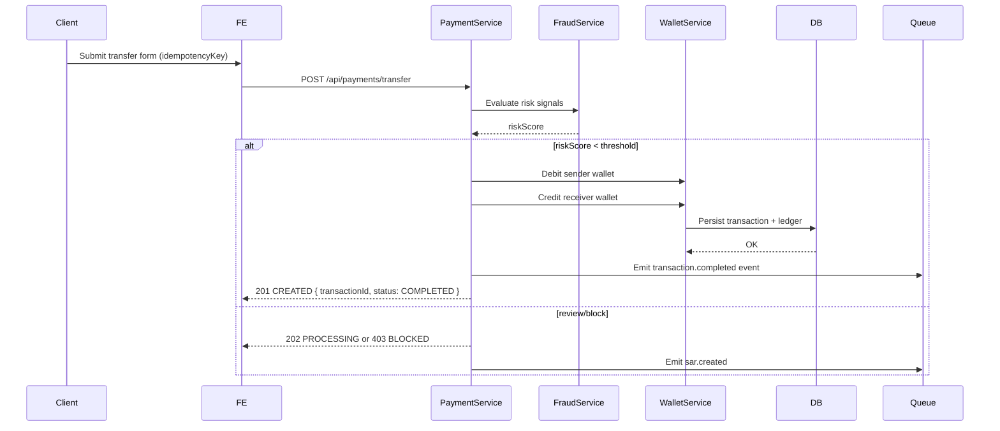
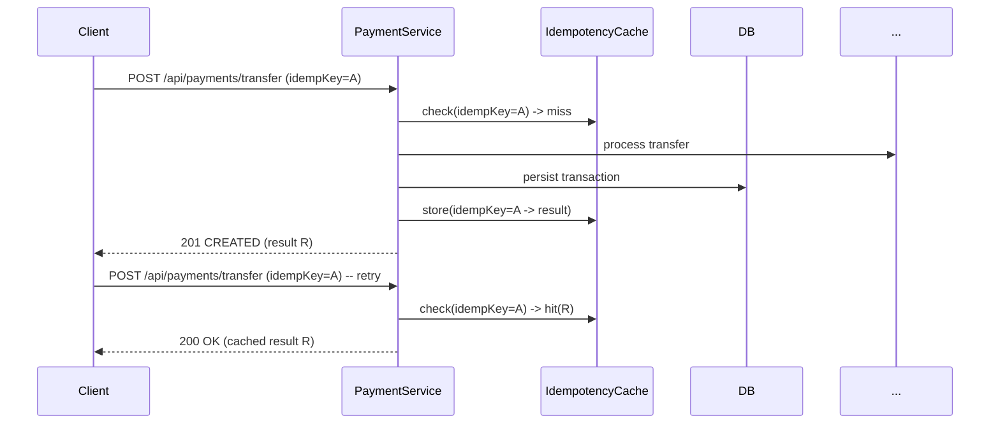
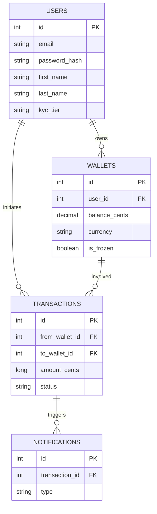
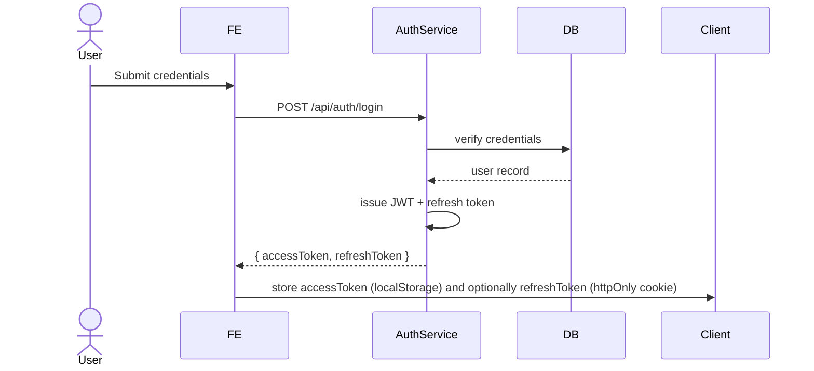
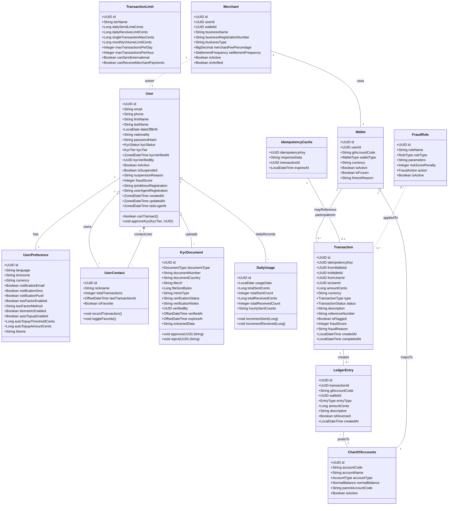

# Advanced Diagrams — Slide Deck (FRE Present)

> Short slide deck with ready-to-render Mermaid diagrams and brief speaker notes. Copy the mermaid code into https://mermaid.live (or use local mermaid tooling) and export SVG/PNG for slides.

---

## Slide 4 — System Architecture (Detailed) ✅

**Speaker notes:** Highlight separation of concerns (Auth, Payment, Wallet), cache & MQ for performance/scaling, and external integrations (Bank, KYC provider). Recommend exporting as SVG for slide use.

---

## Slide 5 — KYC Tier Progression ✅

**Speaker notes:** Explain how KYC tier upgrades increase limits and enable international transfers; call out automated vs manual upgrades.

---

## Slide 7 — P2P Transfer Flow (Sequence) ✅

**Speaker notes:** Emphasize idempotency key usage, fraud gating, and the async notification path; include typical latencies and error handling strategies.

---

## Slide 8 — Idempotency Flow ✅

**Speaker notes:** Note TTL for idempotency cache (24h), storage of full response for stable retries, and that duplicate requests should never create new ledger entries.

---

## Slide 9 — ERD (Backup reference)

**Speaker notes:** Keep this slide as a compact backup — show ownership and critical monetary fields.

---

## Slide 10 — Authentication Flow (Nice to have)

**Speaker notes:** Recommend short TTL for access tokens and refresh tokens stored in httpOnly cookies for better security.

---

## Export & Render Instructions

- Copy each mermaid block into https://mermaid.live and export **SVG** for slide use.
- I can export all diagrams to `report/diagrams/` as SVG files if you want — say “Export SVGs” and I’ll generate them.

---

*Created: December 24, 2025*

